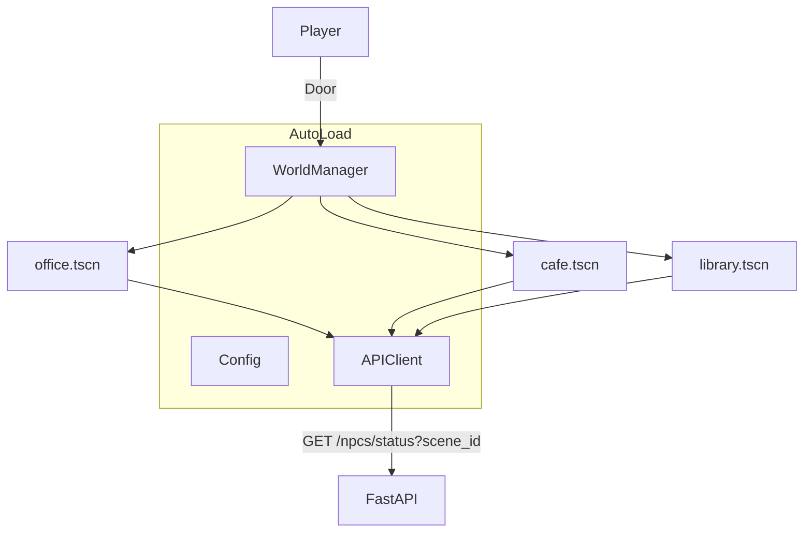
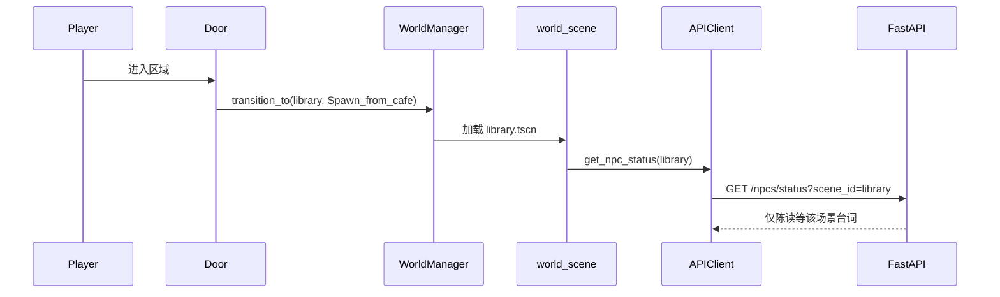

# 多场景赛博小镇

## 实现状态摘要

| 项目 | 状态 |
|------|------|
| `office.tscn` / `cafe.tscn` / `library.tscn` | ✅ 已上线，`project.godot` 入口为 office |
| `world_manager.gd` AutoLoad | ✅ `transition_to(scene_id, spawn_id)` |
| `door.gd` 三场景互联 | ✅ |
| `world_scene.gd` 按 `scene_id` 轮询 status | ✅ |
| 后端 `NPC_ROLES` + `scene_id` | ✅ 5 名 NPC（非 6 人；咖啡厅仅小林） |
| `GET /npcs?scene_id=`、`GET /npcs/status?scene_id=` | ✅ |
| `state_manager` 每场景批量生成头顶台词 | ✅ |
| 办公室 NPC 更名程码/林案/苏绘 | ✅ |
| `dialogue_ui` 场景名 / 世界名 | ✅ 可选展示 |
| 公园 `park` | ❌ 已取消（无素材） |
| `room_collisions.gd` + `assets/room_layouts/*.json` | ✅ 家具碰撞 |

---

## 架构（当前）

---

## 场景与 NPC

| scene_id | 场景 | 背景资源 | NPC |
|----------|------|----------|-----|
| `office` | `office.tscn` | Japanese_Home | 程码、林案、苏绘 |
| `cafe` | `cafe.tscn` | 1_Generic | 小林 |
| `library` | `library.tscn` | 13_Conference_Hall | 陈读 |

**更名对照（已完成）：**

| 旧名 | 新名 |
|------|------|
| 张三 | 程码 |
| 李四 | 林案 |
| 王五 | 苏绘 |

`memory_data/旧名/` 需手动重命名目录才能延续旧存档。

---

## 后端要点

- `agents.NPC_ROLES`：`scene_id`, `world_name`, `interaction_hint`
- `npc_names_for_scene(scene_id)`、`list_npcs(scene_id)`
- `batch_generator.generate_batch_dialogues(scene_id=...)`
- `create_system_prompt` 使用 `world_name` 而非写死「Datawhale 办公室」

---

## Godot 要点

- `config.gd`：`SCENE_IDS`, `SCENE_DISPLAY_NAMES`, `NPC_NAMES`（5 人）
- `api_client.get_npc_status(scene_id)` → `?scene_id=`
- `npc.gd`：`@export interaction_hint_text`
- 传送：走进 `Area2D` 或 **E**（见 `door.gd` 实现）

Spawn 示例：`Spawn_from_cafe`、`Spawn_from_office`、`Spawn_default`。

---

## 数据流（切场景）

---

## 测试要点

- 三场景门往返，出生点正确
- 仅当前场景 NPC 更新头顶气泡
- 跨场景与同一 NPC 对话：好感/记忆按 `npc_name` 连续（内存好感重启仍丢失）
- 无 LLM 时各场景预设头顶台词仍可用

---

## 风险与后续

- 墙体仍为手工 `StaticBody2D` / JSON 碰撞
- Godot `npc_name` 与 `NPC_ROLES` 键名必须一致
- 若加第四场景（如公园）：需新素材 + `SCENE_IDS` + 后端角色 + batch 预设
- 若需图书馆上下层：可新增楼层传送脚本并挂入 `library.tscn`（`Spawn_library_upper/lower`）

---

## 关键文件

| 操作 | 路径 |
|------|------|
| AutoLoad | `scripts/world_manager.gd`, `api_client.gd`, `config.gd` |
| 场景脚本 | `scripts/world_scene.gd` |
| 门 | `scripts/door.gd`, `scenes/door.tscn` |
| 场景 | `scenes/office.tscn`, `cafe.tscn`, `library.tscn` |
| 后端 | `backend/agents.py`, `batch_generator.py`, `state_manager.py`, `main.py` |
