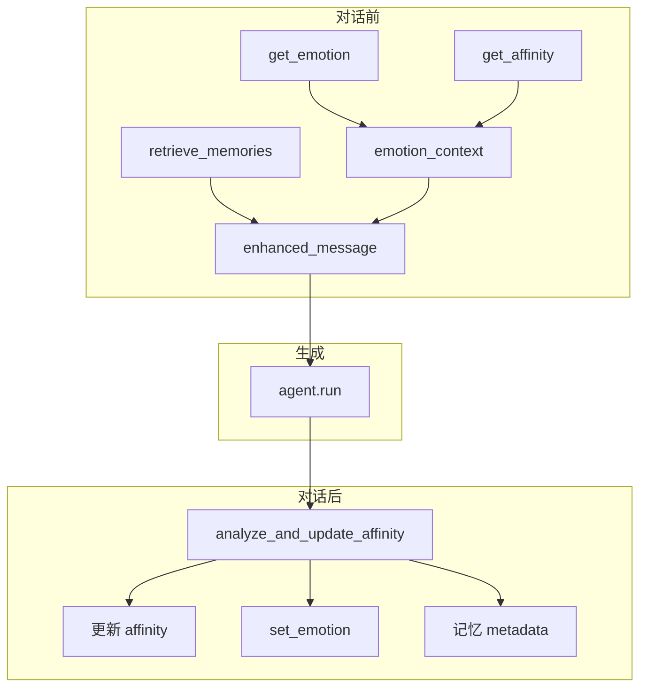

# NPC 情感系统

## 实现状态（截至当前代码库）

| 能力 | 状态 | 位置 |
|------|------|------|
| EmotionManager | ✅ | `backend/emotion_manager.py` |
| 合并分析 emotion | ✅ | `backend/relationship_manager.py` |
| chat 注入 + 更新 | ✅ | `backend/agents.py` |
| REST API | ✅ | `main.py`：`GET/PUT .../emotion`，`GET /emotions` |
| ChatResponse 字段 | ✅ | `models.py` |
| 日志 | ✅ | `logger.py`：`log_emotion`, `log_emotion_change` |
| Godot UI | ✅ | `dialogue_ui.gd` → `EmotionLabel` |
| pytest | ✅ | `tests/test_emotion_*.py`, `test_analyzer_parse.py` |

**未实现（原计划已排除或遗留）：**

- 情绪 / 好感持久化到磁盘（重启归零）
- 头顶批量台词携带情绪（`batch_generator` 未读 EmotionManager）
- NPC 精灵按情绪换肤或动画
- `scripts/smoke_emotion.py`（可选冒烟脚本，仓库未包含）
- 情绪随时间衰减（TTL）

---

## 目标与行为

NPC 具备 `happy` / `sad` / `angry` / `excited` / `neutral`，影响回复语气；Godot 对话面板显示「情绪: 开心」等标签并按 key 着色（`config.gd` → `EMOTION_FONT_COLORS`）。



---

## 架构要点

### EmotionManager

- 存储：`emotion_states[npc][player_id]`，默认 `neutral`
- `get_emotion_modifier()` / `get_emotion_context()` 供 prompt 使用
- 非法 emotion 归一化为 `neutral`

### 合并分析（无额外 LLM 调用）

分析 JSON 示例：

```json
{
  "should_change": true,
  "change_amount": 5,
  "reason": "友好问候",
  "sentiment": "positive",
  "emotion": "happy"
}
```

### API

| 端点 | 说明 |
|------|------|
| `POST /chat` | 响应含 `emotion`, `emotion_label` |
| `GET /npcs/{name}/emotion` | 查询 |
| `GET /emotions` | 全部 NPC |
| `PUT /npcs/{name}/emotion?emotion=happy` | 测试设置 |

### Godot

- `api_client.gd`：`chat_response_received(..., emotion, emotion_label)`，`get_npc_emotion()`
- `dialogue_ui.gd`：开对话拉取情绪；每轮 chat 更新 `EmotionLabel`

---

## 测试

```bash
cd backend
python -m pytest tests/ -v
```

手动：Swagger `PUT` 设 `angry` → `POST /chat`；或 Godot 多轮对话观察标签与 `logs/dialogue_*.log`。

---

## 主要文件

| 文件 | 作用 |
|------|------|
| `emotion_manager.py` | 情绪状态与修饰词 |
| `relationship_manager.py` | 分析含 emotion |
| `agents.py` | 对话主流程 |
| `models.py` / `main.py` | API |
| `logger.py` | 日志 |
| `helloagents-ai-town/scripts/config.gd` | 标签与颜色 |
| `helloagents-ai-town/scripts/dialogue_ui.gd` | UI |

更完整的系统说明见 [AFFINITY_SYSTEM_GUIDE.md](AFFINITY_SYSTEM_GUIDE.md) 与 [backend/README.md](backend/README.md)。
