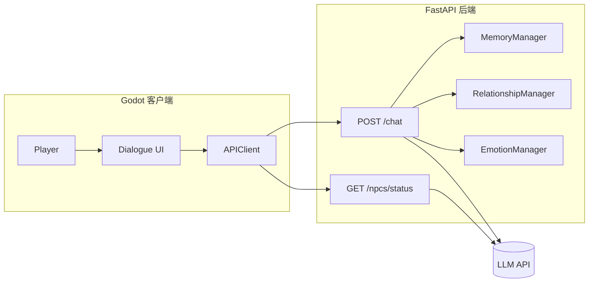

# 赛博小镇 · AI NPC 对话系统

[English](README_EN.md) | 简体中文

基于 [Hello-agents](https://github.com/datawhalechina/hello-agents) 教材第 15 章「赛博小镇」案例的**个人扩展版本**：在 Godot 2D 小镇中与多名 LLM 驱动的 NPC 对话，体验记忆、好感度、情绪与多场景探索。

> 原教材仓库：[datawhalechina/hello-agents](https://github.com/datawhalechina/hello-agents)（Chapter 15）  
> 本仓库在官方案例基础上增加了多场景世界、情绪系统、按场景批量头顶台词、家具碰撞与更完整的文档与测试。

## 预览


## 功能特性

| 模块 | 说明 |
|------|------|
| **多场景世界** | 办公室、咖啡厅、图书馆；`WorldManager` + 传送门切换场景 |
| **5 名 AI NPC** | 程码、林案、苏绘（办公室）；小林（咖啡厅）；陈读（图书馆） |
| **YAML 行为配置** | 人格、初始记忆、情绪/好感基线、环境台词均在 `backend/npc_config/npcs.yaml`，非技术人员可编辑 |
| **智能对话** | FastAPI + HelloAgents `SimpleAgent`；无 API Key 时降级为预设/模拟回复 |
| **记忆系统** | 工作记忆 + 可选情景向量记忆（Qdrant）；详见 [MEMORY_SYSTEM_GUIDE.md](MEMORY_SYSTEM_GUIDE.md) |
| **好感度** | 5 个关系等级，影响对话风格；与情绪同次 LLM 分析，节省调用 |
| **情绪系统** | 开心 / 难过 / 生气 / 兴奋 / 平静；注入 prompt 并在 Godot UI 展示 |
| **自主头顶台词** | 按 `scene_id` 每约 30 秒批量生成，客户端轮询 `GET /npcs/status` |
| **对话流水日志** | 控制台 + 按日文件；见 [DIALOGUE_LOG_GUIDE.md](DIALOGUE_LOG_GUIDE.md) |

### 与官方 Chapter 15 的主要差异

- 三场景互联（`office` / `cafe` / `library`）及后端 `scene_id` 过滤
- NPC 更名与按场景分布；咖啡厅、图书馆专属角色
- 好感度 + 情绪合并分析（`relationship_manager.py`）
- `room_layouts` 家具碰撞、Godot 4.6 工程与 pytest 覆盖

## 技术栈

| 层级 | 技术 |
|------|------|
| 游戏客户端 | Godot 4.2+（工程为 4.6） |
| 后端 | Python 3.10+ · FastAPI · Uvicorn |
| AI 框架 | [hello-agents](https://pypi.org/project/hello-agents/)（pip，`0.2.4`–`0.2.9`） |
| LLM | 默认 ModelScope（Qwen2.5），支持任意 OpenAI 兼容 API |
| 可选向量库 | Qdrant（情景记忆） |

## 项目结构

```text
AgentTown/
├── backend/                 # FastAPI 后端（AI 依赖 pip 包 hello-agents）
│   ├── main.py              # 入口与路由
│   ├── npc_config/
│   │   └── npcs.yaml        # NPC 人格、记忆种子、基线、环境台词
│   ├── npc_config_loader.py
│   ├── agents.py            # NPC 与对话逻辑
│   ├── relationship_manager.py
│   ├── emotion_manager.py
│   ├── batch_generator.py
│   ├── state_manager.py
│   ├── view_logs.py         # 对话日志 CLI
│   ├── requirements.txt
│   └── tests/               # pytest
├── helloagents-ai-town/     # Godot 4 项目
│   ├── project.godot        # 入口场景：scenes/office.tscn
│   ├── scenes/              # office / cafe / library
│   └── scripts/             # API 客户端、对话 UI、WorldManager
├── SETUP_GUIDE.md           # 详细安装说明
└── *_GUIDE.md               # 各子系统文档
```

> **说明：** HelloAgents 通过 `pip install hello-agents` 安装，仓库内不再包含框架源码副本。

## 快速开始

完整步骤见 [SETUP_GUIDE.md](SETUP_GUIDE.md)。

### 1. 克隆仓库

```bash
git clone https://github.com/lcyting/AgentTown.git
cd AgentTown
```

### 2. 启动后端

```bash
cd backend
python -m venv venv

# Windows
venv\Scripts\activate

# macOS / Linux
# source venv/bin/activate

pip install -r requirements.txt
copy .env.example .env    # Windows；Linux/macOS 使用 cp
# 编辑 .env，填写 LLM_API_KEY（可选，不填则使用模拟模式）

python main.py
# 或 Windows: .\start.ps1
```

服务启动后：

- API：http://localhost:8000  
- 交互文档：http://localhost:8000/docs  

### 3. 运行 Godot 客户端

1. 安装 [Godot 4.x](https://godotengine.org/download)
2. 导入 `helloagents-ai-town/project.godot`
3. 确认 `helloagents-ai-town/scripts/config.gd` 中 `API_BASE_URL` 指向后端
4. 按 **F5** 运行（入口场景：`scenes/office.tscn`）

### 操作说明

| 按键 | 功能 |
|------|------|
| WASD / 方向键 | 移动 |
| E | 与附近 NPC 交互 |
| Enter | 发送对话 |
| ESC | 关闭对话框 |

## NPC 与场景

| `scene_id` | NPC | 角色 |
|------------|-----|------|
| `office` | 程码、林案、苏绘 | Python 工程师 / 产品经理 / UI 设计师 |
| `cafe` | 小林 | 咖啡师 |
| `library` | 陈读 | 图书管理员 |

场景间通过门（`door.tscn`）传送；客户端按当前场景轮询 `GET /npcs/status?scene_id=...`。

### 调整 NPC 行为（无需改代码）

编辑 [`backend/npc_config/npcs.yaml`](backend/npc_config/npcs.yaml)（参考 [`npcs.example.yaml`](backend/npc_config/npcs.example.yaml)），修改性格、开局记忆、默认情绪/好感、头顶预设台词后**重启后端**。详见 [backend/README.md#npc-行为配置yaml](backend/README.md)。

## 架构概览



## 文档索引

| 文档 | 说明 |
|------|------|
| [SETUP_GUIDE.md](SETUP_GUIDE.md) | 安装与环境配置 |
| [backend/README.md](backend/README.md) | 后端 API 与目录说明 |
| [AFFINITY_SYSTEM_GUIDE.md](AFFINITY_SYSTEM_GUIDE.md) | 好感度系统 |
| [MEMORY_SYSTEM_GUIDE.md](MEMORY_SYSTEM_GUIDE.md) | 记忆系统 |
| [DIALOGUE_LOG_GUIDE.md](DIALOGUE_LOG_GUIDE.md) | 对话日志 |
| [NPC_EMOTION_SYSTEM_PLAN.md](NPC_EMOTION_SYSTEM_PLAN.md) | 情绪系统设计与实现 |
| [MULTI_SCENE_WORLD_PLAN.md](MULTI_SCENE_WORLD_PLAN.md) | 多场景扩展记录 |
| [helloagents-ai-town/scripts/README.md](helloagents-ai-town/scripts/README.md) | Godot 脚本说明 |

## 测试

```bash
cd backend
python -m pytest tests/ -v
```

覆盖：情绪管理器、情绪 API（mock）、好感度/情绪 JSON 解析、NPC YAML 配置加载。也可在浏览器中使用 Swagger 进行手动联调。

## 常见问题

**后端无法启动？**  
确认 Python ≥ 3.10、已激活虚拟环境，且 `pip install -r requirements.txt` 成功。

**能进游戏但无法对话？**  
检查后端是否在运行，以及 `config.gd` 中的 `API_BASE_URL` 是否与后端地址一致。

**重启后好感/情绪归零？**  
运行时好感/情绪保存在内存中，重启后按 YAML `baselines` 恢复默认；记忆是否持久化见 [MEMORY_SYSTEM_GUIDE.md](MEMORY_SYSTEM_GUIDE.md)。

**如何改 NPC 性格或开局记忆？**  
编辑 `backend/npc_config/npcs.yaml` 并重启后端；改 `initial_memories` 后需清空该 NPC 记忆目录或调用 `DELETE /npcs/{名}/memories`。

## 致谢

- [Datawhale](https://github.com/datawhalechina) · [Hello-agents](https://github.com/datawhalechina/hello-agents) 教材与第 15 章原始案例  
- [HelloAgents](https://pypi.org/project/hello-agents/) 多智能体框架  
- [Godot Engine](https://godotengine.org/)

## 许可证

本项目遵循 **CC BY-NC-SA 4.0**（与 Hello-agents 教材案例一致）。  
非商业使用、署名、相同方式共享。商业使用请联系原作者或权利方。
