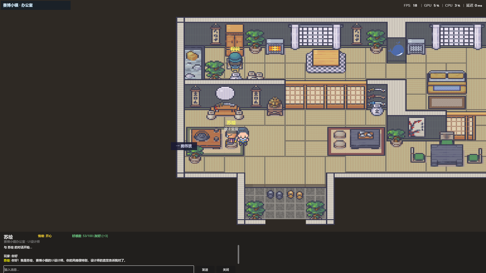
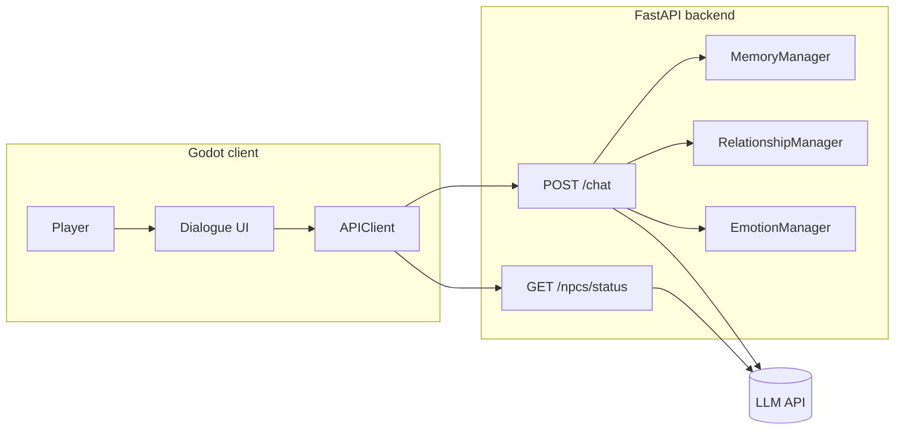

# Cyber Town · AI NPC Dialogue System

English | [简体中文](README.md)

A **personal fork and extension** of the Cyber Town demo from [Hello-agents](https://github.com/datawhalechina/hello-agents) (Chapter 15): explore a 2D Godot town, talk to LLM-powered NPCs, and experiment with memory, affinity, emotions, and multi-scene gameplay.

> Upstream: [datawhalechina/hello-agents](https://github.com/datawhalechina/hello-agents) (Chapter 15)  
> This repo adds a multi-scene world, an emotion system, per-scene ambient NPC lines, room collision layouts, and expanded docs/tests on top of the official sample.

## Preview



## Features

| Module | Description |
|--------|-------------|
| **Multi-scene world** | Office, café, library; `WorldManager` + doors for scene transitions |
| **5 AI NPCs** | Cheng Ma, Lin An, Su Hui (office); Xiao Lin (café); Chen Du (library) |
| **YAML behavior config** | Personality, seed memories, emotion/affinity baselines, ambient lines in `backend/npc_config/npcs.yaml` |
| **Smart dialogue** | FastAPI + HelloAgents `SimpleAgent`; falls back to canned/mock replies without an API key |
| **Memory** | Working memory + optional episodic vector memory (Qdrant) — see [MEMORY_SYSTEM_GUIDE.md](MEMORY_SYSTEM_GUIDE.md) |
| **Affinity** | 5 relationship tiers affecting reply style; analyzed in the same LLM call as emotion |
| **Emotions** | happy / sad / angry / excited / calm; injected into prompts and shown in the Godot UI |
| **Ambient overhead lines** | Batch-generated per `scene_id` ~every 30s; client polls `GET /npcs/status` |
| **Dialogue logs** | Console + daily log files — see [DIALOGUE_LOG_GUIDE.md](DIALOGUE_LOG_GUIDE.md) |

### Changes vs. official Chapter 15

- Three linked scenes (`office` / `cafe` / `library`) with backend `scene_id` filtering  
- Renamed NPCs and per-scene placement, including café and library characters  
- Combined affinity + emotion analysis (`relationship_manager.py`)  
- Furniture collision via `room_layouts`, Godot 4.6 project, and pytest coverage  

## Tech stack

| Layer | Stack |
|-------|--------|
| Game client | Godot 4.2+ (project targets 4.6) |
| Backend | Python 3.10+ · FastAPI · Uvicorn |
| AI framework | [hello-agents](https://pypi.org/project/hello-agents/) (pip, `0.2.4`–`0.2.9`) |
| LLM | ModelScope (Qwen2.5) by default; any OpenAI-compatible API |
| Optional vectors | Qdrant for episodic memory |

## Project layout

```text
AgentTown/
├── backend/                 # FastAPI server (hello-agents via pip)
│   ├── main.py
│   ├── npc_config/npcs.yaml # NPC personality, memories, baselines, ambient dialogues
│   ├── npc_config_loader.py
│   ├── agents.py
│   ├── relationship_manager.py
│   ├── emotion_manager.py
│   ├── batch_generator.py
│   ├── state_manager.py
│   ├── view_logs.py         # dialogue log CLI
│   ├── requirements.txt
│   └── tests/
├── helloagents-ai-town/     # Godot 4 project
│   ├── project.godot        # main scene: scenes/office.tscn
│   ├── scenes/              # office / cafe / library
│   └── scripts/
├── SETUP_GUIDE.md
└── *_GUIDE.md               # subsystem docs (mostly Chinese)
```

> **Note:** HelloAgents is installed from PyPI (`hello-agents`); the repo does not vendor the framework source tree.

## Quick start

See [SETUP_GUIDE.md](SETUP_GUIDE.md) for the full walkthrough (Chinese).

### 1. Clone

```bash
git clone https://github.com/<your-username>/Helloagents-AI-Town.git
cd Helloagents-AI-Town
```

### 2. Backend

```bash
cd backend
python -m venv venv

# Windows
venv\Scripts\activate

# macOS / Linux
# source venv/bin/activate

pip install -r requirements.txt
cp .env.example .env    # Windows: copy .env.example .env
# Edit .env and set LLM_API_KEY (optional — mock mode works without it)

python main.py
# Windows alternative: .\start.ps1
```

- API: http://localhost:8000  
- Docs: http://localhost:8000/docs  

### 3. Godot client

1. Install [Godot 4.x](https://godotengine.org/download)  
2. Import `helloagents-ai-town/project.godot`  
3. Ensure `helloagents-ai-town/scripts/config.gd` → `API_BASE_URL` matches the backend  
4. Press **F5** (main scene: `scenes/office.tscn`)  

### Controls

| Key | Action |
|-----|--------|
| WASD / arrows | Move |
| E | Talk to nearby NPC |
| Enter | Send message |
| ESC | Close dialogue |

## NPCs and scenes

| `scene_id` | NPCs | Roles |
|------------|------|-------|
| `office` | Cheng Ma, Lin An, Su Hui | Python engineer / PM / UI designer |
| `cafe` | Xiao Lin | Barista |
| `library` | Chen Du | Librarian |

Use doors (`door.tscn`) to travel between scenes. The client polls `GET /npcs/status?scene_id=...` for the active scene.

### Tuning NPC behavior (no code changes)

Edit [`backend/npc_config/npcs.yaml`](backend/npc_config/npcs.yaml) (see [`npcs.example.yaml`](backend/npc_config/npcs.example.yaml)), then **restart the backend**. Details: [backend/README.md](backend/README.md).

## Architecture



## Documentation

| Doc | Topic |
|-----|--------|
| [SETUP_GUIDE.md](SETUP_GUIDE.md) | Install & env (Chinese) |
| [backend/README.md](backend/README.md) | Backend API |
| [AFFINITY_SYSTEM_GUIDE.md](AFFINITY_SYSTEM_GUIDE.md) | Affinity |
| [MEMORY_SYSTEM_GUIDE.md](MEMORY_SYSTEM_GUIDE.md) | Memory |
| [DIALOGUE_LOG_GUIDE.md](DIALOGUE_LOG_GUIDE.md) | Dialogue logs |
| [NPC_EMOTION_SYSTEM_PLAN.md](NPC_EMOTION_SYSTEM_PLAN.md) | Emotion system |
| [MULTI_SCENE_WORLD_PLAN.md](MULTI_SCENE_WORLD_PLAN.md) | Multi-scene notes |
| [helloagents-ai-town/scripts/README.md](helloagents-ai-town/scripts/README.md) | Godot scripts |

## Testing

```bash
cd backend
python -m pytest tests/ -v
```

Covers emotion manager, emotion API (mock), affinity/emotion JSON parsing, and NPC YAML config loading. Use Swagger at http://localhost:8000/docs for manual API tests.

## FAQ

**Backend won’t start?**  
Use Python 3.10+, activate the venv, and run `pip install -r requirements.txt`.

**Game runs but no dialogue?**  
Confirm the backend is up and `API_BASE_URL` in `config.gd` points to it.

**Affinity/emotion reset after restart?**  
In-session changes are in-memory only; after restart, **defaults** come from `npcs.yaml` `baselines`. Memory persistence — see [MEMORY_SYSTEM_GUIDE.md](MEMORY_SYSTEM_GUIDE.md).

**Change NPC personality or seed memories?**  
Edit `backend/npc_config/npcs.yaml` and restart; for `initial_memories`, clear `memory_data/{name}/` or `DELETE /npcs/{name}/memories` first.

## Acknowledgments

- [Datawhale](https://github.com/datawhalechina) · [Hello-agents](https://github.com/datawhalechina/hello-agents) textbook and Chapter 15 sample  
- [HelloAgents](https://pypi.org/project/hello-agents/) multi-agent framework  
- [Godot Engine](https://godotengine.org/)

## License

**CC BY-NC-SA 4.0**, consistent with the Hello-agents course materials.  
Non-commercial use with attribution and share-alike. Contact rights holders for commercial use.
